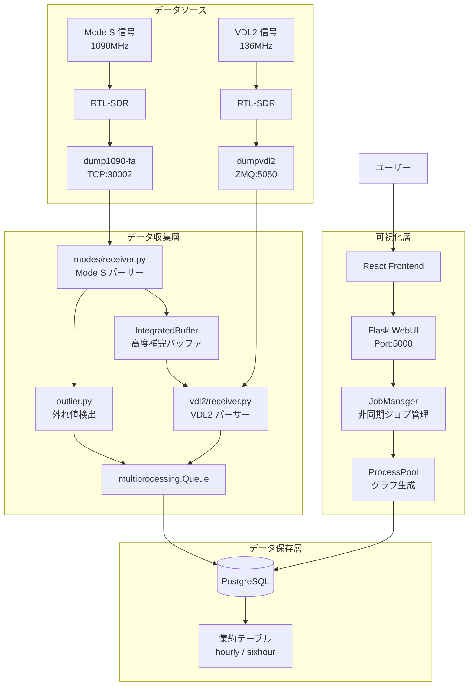
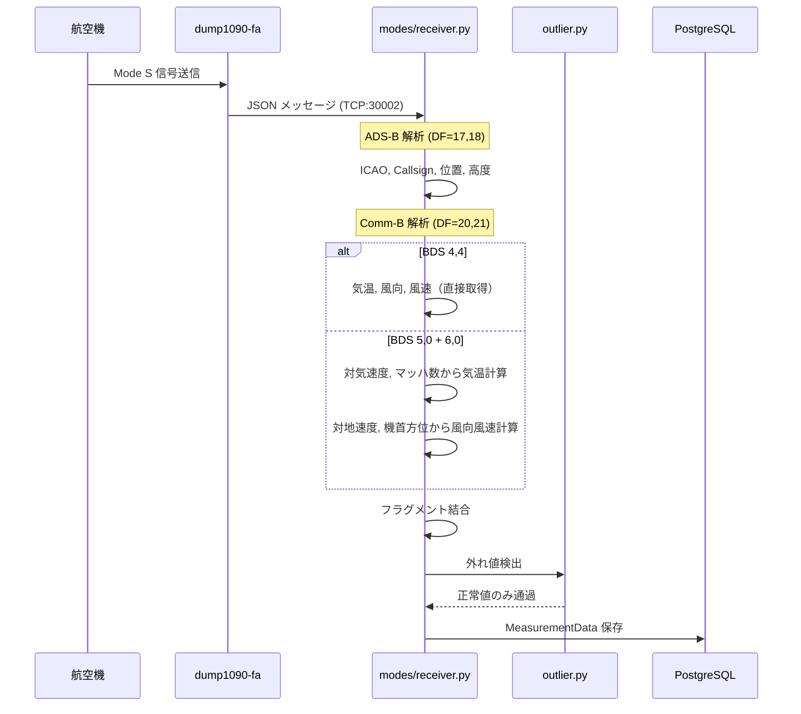
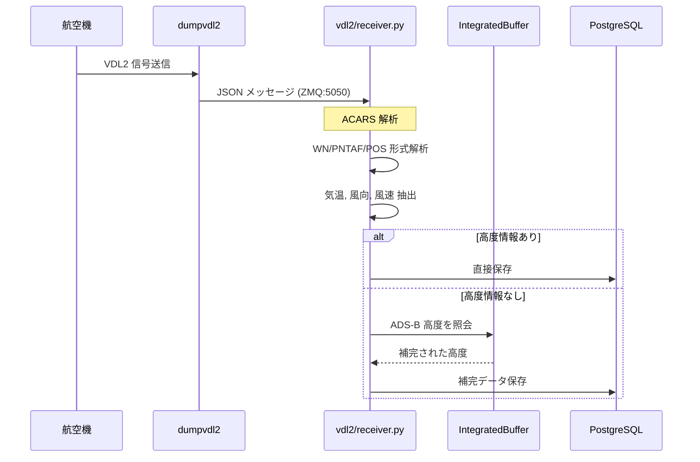
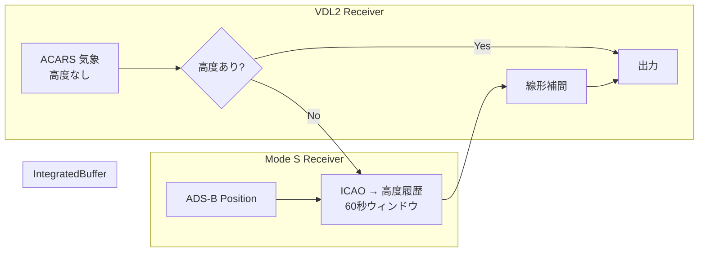

# modes-sensing

航空機から送信される Mode S / VDL2 メッセージを受信し、気象データを可視化するシステム

[](https://github.com/kimata/modes-sensing/actions/workflows/test.yaml)
[](https://kimata.github.io/modes-sensing/pytest.html)
[](https://coveralls.io/github/kimata/modes-sensing?branch=main)

## 目次

- [概要](#概要)
- [システムアーキテクチャ](#システムアーキテクチャ)
    - [全体構成](#全体構成)
    - [データソース](#データソース)
    - [データフロー](#データフロー)
    - [モジュール構成](#モジュール構成)
- [セットアップ](#セットアップ)
- [実行方法](#実行方法)
- [設定ファイル](#設定ファイル)
- [API エンドポイント](#api-エンドポイント)
- [グラフの種類](#グラフの種類)
- [技術詳細](#技術詳細)
- [テスト](#テスト)
- [トラブルシューティング](#トラブルシューティング)
- [ライセンス](#ライセンス)

## 概要

航空機が送信する SSR Mode S メッセージ（BDS 4,4 / BDS 5,0 / BDS 6,0）および VDL2 ACARS メッセージから気象データ（気温・風速・風向）を抽出し、可視化するシステムです。

### 主な特徴

- **デュアルデータソース** - Mode S (1090MHz) と VDL2 (136MHz) の両方に対応
- **リアルタイム受信** - 航空機からのメッセージをリアルタイムで受信・デコード
- **高度補完** - VDL2 データの不足高度を ADS-B データで補完
- **外れ値検出** - 機械学習（IsolationForest）による異常値自動除去
- **多彩な可視化** - 8種類のグラフタイプ（2D/3D 散布図、ヒートマップ、等高線など）
- **非同期グラフ生成** - マルチプロセスによる高速なグラフ生成
- **時間帯別集約** - 長期データの効率的なストレージと高速クエリ

## システムアーキテクチャ

### 全体構成



### データソース

本システムは2つのデータソースに対応しています：

| データソース | 周波数  | デコーダ    | プロトコル | 含まれるデータ                        |
| ------------ | ------- | ----------- | ---------- | ------------------------------------- |
| Mode S       | 1090MHz | dump1090-fa | TCP JSON   | 位置、高度、速度、気象（BDS44/50/60） |
| VDL2         | 136MHz  | dumpvdl2    | ZMQ JSON   | ACARS 気象報告、XID 位置情報          |

### データフロー

#### Mode S 収集パイプライン



#### VDL2 収集パイプライン



#### 高度補完メカニズム

VDL2 ACARS メッセージは高度情報を含まないことが多いため、IntegratedBuffer を使用して ADS-B からの高度データで補完します：



### モジュール構成

```
src/
├── collect_combined.py            # Mode S + VDL2 統合収集
├── collect_vdl2.py                # VDL2 のみ収集（デバッグ用）
└── amdar/
    ├── __main__.py                # amdar コマンド (Mode S 収集)
    ├── cli_collect.py             # amdar エントリポイント実装
    ├── cli_webui.py               # amdar-webui (Flask Web サーバー)
    ├── cli_healthz.py             # amdar-healthz (ヘルスチェック)
    ├── config.py                  # 設定 dataclass
    ├── core/
    │   └── types.py               # WeatherObservation, WindData
    ├── sources/
    │   ├── modes/
    │   │   └── receiver.py        # Mode S メッセージ解析
    │   ├── vdl2/
    │   │   ├── receiver.py        # VDL2 ZMQ 受信
    │   │   └── parser.py          # ACARS メッセージ解析
    │   ├── aggregator.py          # ADS-B 高度バッファ
    │   └── outlier.py             # 外れ値検出
    ├── database/
    │   ├── postgresql.py          # PostgreSQL インターフェース
    │   └── sqlite.py              # SQLite（開発用）
    └── viewer/
        └── api/
            ├── graph.py           # グラフ生成
            ├── job_manager.py     # 非同期ジョブ管理
            └── progress_estimation.py
```

```
react/
└── src/
    ├── App.tsx                    # メインアプリ
    ├── components/
    │   ├── DateSelector.tsx       # 日時選択
    │   ├── GraphDisplay.tsx       # グラフ表示グリッド
    │   ├── Modal.tsx              # 画像拡大モーダル
    │   └── Footer.tsx
    └── hooks/
        ├── useGraphJobs.ts        # グラフジョブ管理
        └── useApi.ts              # API 通信
```

## セットアップ

### 必要な環境

- Python 3.11+ （推奨: 3.13）
- Node.js 18.x+
- PostgreSQL 14+
- RTL-SDR ドングル（2台：Mode S 用 + VDL2 用）
- Docker

### 1. 依存パッケージのインストール

```bash
# Python 環境
curl -LsSf https://astral.sh/uv/install.sh | sh
uv sync

# React 環境
cd react && npm ci
```

### 2. デコーダの準備

#### dump1090-fa（Mode S 用）

```bash
docker run -d \
  --name dump1090-fa \
  --device=/dev/bus/usb \
  --restart=unless-stopped \
  -p 30002:30002 \
  -p 8080:8080 \
  registry.gitlab.com/kimata/dump1090-fa:latest
```

#### dumpvdl2（VDL2 用）

```bash
# dumpvdl2 のインストールと起動は環境に依存
# ZMQ 出力を有効にして起動（デフォルト: tcp://*:5050）
```

## 実行方法

### データ収集

```bash
# Mode S のみ
uv run amdar

# Mode S + VDL2 統合（推奨）
uv run python src/collect_combined.py

# VDL2 のみ（デバッグ用）
uv run python src/collect_vdl2.py
```

### Web インターフェース

```bash
# React ビルド
cd react && npm run build && cd ..

# Flask サーバー起動
uv run amdar-webui
# → http://localhost:5000
```

## 設定ファイル

`config.yaml` の構成：

```yaml
decoder:
    modes:
        host: localhost
        port: 30002 # dump1090-fa TCP ポート
    vdl2: # オプション
        host: 192.168.0.20
        port: 5050 # dumpvdl2 ZMQ ポート

database:
    host: localhost
    port: 5432
    name: flight_weather
    user: postgres
    pass: postgres

filter:
    area:
        lat:
            ref: 35.682677 # 基準緯度（東京）
        lon:
            ref: 139.762230 # 基準経度
        distance: 100 # フィルタ距離 (km)

liveness:
    file:
        collector: /dev/shm/modes-sensing/liveness/collector
        receiver:
            modes: /dev/shm/modes-sensing/liveness/modes
            vdl2: /dev/shm/modes-sensing/liveness/vdl2
    schedule:
        daytime:
            start_hour: 7
            end_hour: 22
            timeout_sec: 60 # 昼間: 1分タイムアウト
        nighttime:
            timeout_sec: 3600 # 夜間: 1時間タイムアウト

webapp:
    static_dir_path: react/dist
    cache_dir_path: cache

slack: # オプション
    from: ModeS sensing
    bot_token: xoxp-XXX...
    error:
        channel:
            name: "#error"
        interval_min: 60
```

## API エンドポイント

### グラフ生成（非同期）

```
POST /modes-sensing/api/graph/job
{
    "graphs": ["scatter_2d", "heatmap"],
    "start": "2025-01-01T00:00:00Z",
    "end": "2025-01-07T00:00:00Z",
    "limit_altitude": false
}
→ {"jobs": [{"job_id": "uuid", "graph_name": "scatter_2d"}, ...]}

POST /modes-sensing/api/graph/jobs/status
{"job_ids": ["uuid1", "uuid2"]}
→ {"jobs": [{"job_id": "...", "status": "completed", "progress": 100}, ...]}

GET /modes-sensing/api/graph/job/{job_id}/result
→ PNG 画像
```

### データ情報

```
GET /modes-sensing/api/data-range
→ {"earliest": "2025-01-01T00:00:00Z", "latest": "2025-01-07T00:00:00Z", "count": 12345}
```

## グラフの種類

| graph_name       | 説明                     | 用途             |
| ---------------- | ------------------------ | ---------------- |
| `scatter_2d`     | 時間-高度-温度 2D 散布図 | 全体傾向の把握   |
| `scatter_3d`     | 3次元散布図              | 立体的データ分布 |
| `heatmap`        | 補間した温度分布         | 連続的温度変化   |
| `contour_2d`     | 等温線                   | 温度層境界       |
| `contour_3d`     | 3次元等温面              | 複雑な温度構造   |
| `density`        | 高度-温度分布密度        | データ集中度分析 |
| `temperature`    | 時間-温度時系列          | 温度変化追跡     |
| `wind_direction` | 高度別風向・風速         | 風パターン分析   |

## 技術詳細

### Mode S BDS レジスタ

| BDS | 内容           | 抽出データ                   |
| --- | -------------- | ---------------------------- |
| 4,4 | 気象データ     | 気温、風速、風向（直接）     |
| 5,0 | トラック・速度 | 対地速度、トラック角         |
| 6,0 | 機首方位・速度 | 機首方位、対気速度、マッハ数 |

BDS 5,0 + 6,0 からの気温計算：

```
温度 = (対気速度 / マッハ数)² / (比熱比 × 気体定数) - 273.15
```

### VDL2 ACARS メッセージ形式

| 形式  | 使用航空会社 | 含まれるデータ                       |
| ----- | ------------ | ------------------------------------ |
| WN    | ANA 等       | 緯度、経度、高度、気温、風向、風速   |
| PNTAF | JAL 等       | 緯度、経度、高度、気温、風向、風速   |
| POS   | FedEx 等     | 緯度、経度、FL高度、気温、風向、風速 |

### データベース集約戦略

| 保持期間 | テーブル              | 集約レベル   |
| -------- | --------------------- | ------------ |
| 0-7日    | meteorological_data   | 生データ     |
| 7-30日   | hourly_altitude_grid  | 1時間 × 500m |
| 30日以上 | sixhour_altitude_grid | 6時間 × 500m |

### スレッディングモデル

| コンポーネント     | 種類   | 用途                   |
| ------------------ | ------ | ---------------------- |
| modes_receiver     | Thread | TCP ソケット読み取り   |
| vdl2_receiver      | Thread | ZMQ ソケット読み取り   |
| database storage   | Thread | キュー消費、バッチ挿入 |
| ProcessPool        | Pool   | 非同期グラフ生成       |
| JobManager cleanup | Thread | 結果期限切れ処理       |

## テスト

```bash
# 全テスト
uv run pytest

# ユニットテストのみ
uv run pytest tests/unit/

# 統合テスト
uv run pytest tests/integration/

# カバレッジレポート
uv run pytest --cov=src --cov-report=html
```

## トラブルシューティング

### RTL-SDR が認識されない

```bash
lsusb | grep RTL
sudo usermod -a -G plugdev $USER
```

### dump1090-fa 接続エラー

```bash
docker logs dump1090-fa
nc localhost 30002  # データ受信確認
```

### VDL2 データが来ない

```bash
# ZMQ 接続テスト
python -c "import zmq; ctx=zmq.Context(); s=ctx.socket(zmq.SUB); s.connect('tcp://192.168.0.20:5050'); s.setsockopt(zmq.SUBSCRIBE, b''); print(s.recv())"
```

### グラフが生成されない

1. データ範囲の確認: `/api/data-range`
2. ジョブステータスの確認: `/api/graph/job/{id}/status`
3. Flask ログでエラー確認

## ライセンス

Apache License Version 2.0

---

[Issue 報告](https://github.com/kimata/modes-sensing/issues) | [Wiki](https://github.com/kimata/modes-sensing/wiki)
