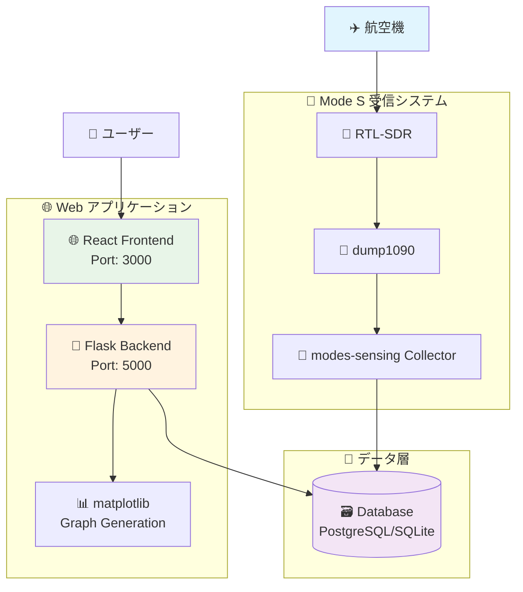
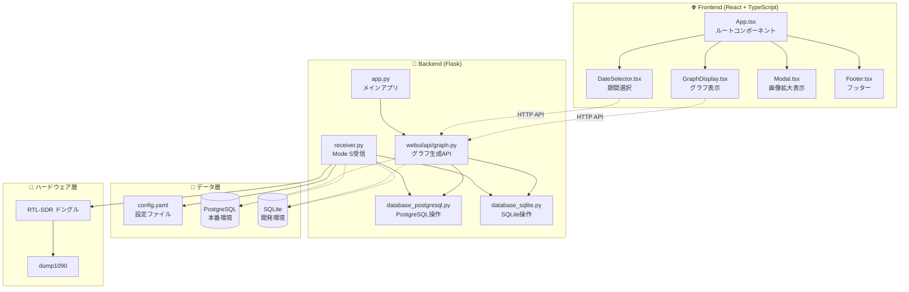

# ✈️ modes-sensing

航空機から送信される Mode S メッセージを受信し、気象データを可視化するシステム

[](https://github.com/kimata/modes-sensing/actions/workflows/regression.yaml)

## 📑 目次

- [📋 概要](#-概要)
    - [主な特徴](#主な特徴)
- [🖼️ スクリーンショット](#️-スクリーンショット)
- [🎮 デモ](#-デモ)
- [🏗️ システム構成](#️-システム構成)
    - [アーキテクチャ概要](#アーキテクチャ概要)
    - [データフロー](#データフロー)
    - [コンポーネント構成](#コンポーネント構成)
- [🚀 セットアップ](#-セットアップ)
    - [必要な環境](#必要な環境)
    - [1. 依存パッケージのインストール](#1-依存パッケージのインストール)
    - [2. Mode S デコーダーの準備](#2-mode-s-デコーダーの準備)
    - [3. 設定ファイルの準備](#3-設定ファイルの準備)
    - [4. データベースの準備](#4-データベースの準備)
- [💻 実行方法](#-実行方法)
    - [データ収集の開始](#データ収集の開始)
    - [Web インターフェースの起動](#web-インターフェースの起動)
    - [開発モード](#開発モード)
- [🧪 テスト](#-テスト)
- [🎯 API エンドポイント](#-api-エンドポイント)
    - [グラフ生成](#グラフ生成)
    - [ヘルスチェック](#ヘルスチェック)
- [📊 グラフの種類](#-グラフの種類)
- [🔧 カスタマイズ](#-カスタマイズ)
    - [フィルタリング設定](#フィルタリング設定)
    - [グラフのカスタマイズ](#グラフのカスタマイズ)
- [📡 Mode S について](#-mode-s-について)
- [🛠️ トラブルシューティング](#️-トラブルシューティング)
- [📊 CI/CD](#-cicd)
- [📝 ライセンス](#-ライセンス)

## 📋 概要

航空機が送信する Mode S メッセージ（BDS 4,4 および BDS 4,5）から気象データ（気温・風速・風向）を抽出し、可視化するシステムです。高度別の大気状態をリアルタイムで観測できます。

### 主な特徴

- ✈️ **リアルタイム受信** - Mode S メッセージをリアルタイムで受信・デコード
- 🌡️ **気象データ抽出** - 航空機から送信される気温・風速・風向データを取得
- 📊 **多彩な可視化** - 2D/3D 散布図、ヒートマップ、等高線プロットなど
- 🗄️ **データベース保存** - PostgreSQL/SQLite による長期データ保存
- 📅 **期間選択** - 過去24時間、7日間、1ヶ月間、カスタム期間での表示
- 🚀 **高速処理** - カラム選択による最適化されたデータベースアクセス
- 📱 **レスポンシブUI** - スマートフォンからPCまで対応

## 🖼️ スクリーンショット

<div align="center">
  
</div>

## 🎮 デモ

実際の動作を体験できるデモサイト（準備中）：

🔗 https://modes-sensing-demo.example.com/

## 🏗️ システム構成

### アーキテクチャ概要



### データフロー


### コンポーネント構成



## 🚀 セットアップ

### 必要な環境

- **Python 3.10+** - メインアプリケーション
- **Node.js 18.x 以上** - React フロントエンド
- **PostgreSQL 14+** (本番環境) または **SQLite** (開発環境)
- **RTL-SDR ドングル** - Mode S 信号受信用
- **dump1090** - Mode S デコーダー

### 1. 依存パッケージのインストール

```bash
# システムパッケージ
sudo apt update
sudo apt install postgresql postgresql-contrib
sudo apt install rtl-sdr dump1090-mutability

# Python環境（uvを使用）
curl -LsSf https://astral.sh/uv/install.sh | sh
uv sync

# React環境
cd react
npm ci
```

### 2. Mode S デコーダーの準備

#### RTL-SDR ドングルの設定

```bash
# RTL-SDR ドライバーの確認
lsusb | grep RTL

# dump1090 の動作確認
dump1090 --interactive --net
```

#### dump1090 の設定

設定ファイル `/etc/default/dump1090-mutability` を編集：

```bash
# Mode S 受信設定
START_DUMP1090="yes"
DUMP1090_USER="dump1090"
RECEIVER_OPTIONS="--gain -10 --fix"
DECODER_OPTIONS="--max-range 360"
NET_OPTIONS="--net --net-heartbeat 60 --net-ro-size 1024 --net-ro-interval 1"
JSON_OPTIONS="--json-location-accuracy 2"
```

サービスの起動：

```bash
sudo systemctl enable dump1090-mutability
sudo systemctl start dump1090-mutability
```

### 3. 設定ファイルの準備

```bash
cp config.example.yaml config.yaml
# config.yaml を環境に合わせて編集
```

設定項目の例：

```yaml
database:
    # PostgreSQL（本番環境）
    postgresql:
        host: "localhost"
        port: 5432
        database: "modes_sensing"
        user: "modes_user"
        password: "password"

    # SQLite（開発環境）
    sqlite:
        file: "data/modes_sensing.db"

receiver:
    # dump1090 接続設定
    host: "localhost"
    port: 30003

    # フィルタリング設定
    distance_threshold: 100 # km
    altitude_min: 1000 # ft
    altitude_max: 45000 # ft

webui:
    # Flask 設定
    host: "0.0.0.0"
    port: 5000
    debug: false

liveness:
    # ヘルスチェック設定
    file:
        collector: "/tmp/modes-sensing-collector.liveness"
```

### 4. データベースの準備

#### PostgreSQL の場合

```bash
# データベースとユーザーの作成
sudo -u postgres psql << EOF
CREATE DATABASE modes_sensing;
CREATE USER modes_user WITH PASSWORD 'password';
GRANT ALL PRIVILEGES ON DATABASE modes_sensing TO modes_user;
\q
EOF

# テーブルの作成
uv run python src/create_table.py
```

#### SQLite の場合

```bash
# データディレクトリの作成
mkdir -p data

# テーブルの作成
uv run python src/create_table.py -d sqlite
```

## 💻 実行方法

### データ収集の開始

```bash
# Mode S メッセージの収集開始
uv run python src/collect.py

# 設定ファイルを指定して実行
uv run python src/collect.py -c custom_config.yaml

# デバッグモードで実行
uv run python src/collect.py -D

# バックグラウンドで実行
nohup uv run python src/collect.py > collect.log 2>&1 &
```

### Web インターフェースの起動

#### 本番環境での起動

```bash
# React アプリのビルド
cd react
npm run build
cd ..

# Flask サーバーの起動
uv run python src/app.py

# 設定ファイルを指定
uv run python src/app.py -c production_config.yaml

# ポート指定
uv run python src/app.py -p 8080
```

#### 開発モード

```bash
# React開発サーバー（ホットリロード対応）
cd react
npm start
# ブラウザで http://localhost:3000 にアクセス

# 別ターミナルでFlaskサーバー（デバッグモード）
uv run python src/app.py -D
# API は http://localhost:5000 で稼働
```

#### Docker での実行

```bash
# Docker イメージのビルド
docker build -t modes-sensing .

# コンテナの実行
docker run -d \
  --name modes-sensing \
  --device=/dev/bus/usb \
  -p 5000:5000 \
  -v $(pwd)/config.yaml:/app/config.yaml \
  -v $(pwd)/data:/app/data \
  modes-sensing
```

最終的にブラウザで http://localhost:5000 にアクセス

## 🧪 テスト

```bash
# 全テストの実行
uv run pytest

# カバレッジ付きテスト実行
uv run pytest --cov=src --cov-report=html

# 特定のテストファイルを実行
uv run pytest tests/test_database.py

# 詳細モードでの実行
uv run pytest -v -s

# pre-commit フックの実行
uv run pre-commit run --all-files
```

テスト結果の確認：

- **HTMLカバレッジレポート**: `htmlcov/index.html`
- **テストログ**: コンソール出力
- **pre-commit結果**: lint、format、型チェックの結果

## 🎯 API エンドポイント

### グラフ生成

- `GET /api/graph/scatter_2d` - 2D散布図の生成
- `GET /api/graph/scatter_3d` - 3D散布図の生成
- `GET /api/graph/heatmap` - ヒートマップの生成
- `GET /api/graph/contour_2d` - 2D等高線図の生成
- `GET /api/graph/contour_3d` - 3D等高線図の生成
- `GET /api/graph/density` - 密度プロットの生成

#### パラメータ

| パラメータ | 型     | 説明                | 例                    |
| ---------- | ------ | ------------------- | --------------------- |
| `start`    | string | 開始日時 (ISO 8601) | `2025-08-01T00:00:00` |
| `end`      | string | 終了日時 (ISO 8601) | `2025-08-03T23:59:59` |
| `distance` | number | 距離フィルタ (km)   | `100`                 |

#### レスポンス例

```bash
# 2D散布図の生成
curl "http://localhost:5000/api/graph/scatter_2d?start=2025-08-01T00:00:00&end=2025-08-03T23:59:59&distance=100"
```

### ヘルスチェック

- `GET /healthz` - サービスの生存確認
- `GET /api/status` - 詳細なステータス情報

レスポンス例：

```json
{
    "status": "healthy",
    "collector": {
        "running": true,
        "last_update": "2025-08-03T16:30:00Z"
    },
    "database": {
        "connection": "ok",
        "last_record": "2025-08-03T16:29:45Z"
    }
}
```

## 📊 グラフの種類

| グラフタイプ | 説明                           | 適用場面                 | API エンドポイント      |
| ------------ | ------------------------------ | ------------------------ | ----------------------- |
| 2D散布図     | 時間-高度-温度の関係を点で表示 | 全体的な傾向の把握       | `/api/graph/scatter_2d` |
| 3D散布図     | 時間-高度-温度を3次元で表示    | 立体的なデータ分布の確認 | `/api/graph/scatter_3d` |
| ヒートマップ | 格子状に補間した温度分布       | 連続的な温度変化の可視化 | `/api/graph/heatmap`    |
| 2D等高線     | 等温線による表示               | 温度層の境界確認         | `/api/graph/contour_2d` |
| 3D等高線     | 3次元の等温面表示              | 複雑な温度構造の把握     | `/api/graph/contour_3d` |
| 密度プロット | 高度-温度の分布密度            | データの集中度分析       | `/api/graph/density`    |

## 🔧 カスタマイズ

### フィルタリング設定

`config.yaml` でデータフィルタリングの設定をカスタマイズできます：

```yaml
receiver:
    # 距離フィルタ（観測地点からの距離）
    distance_threshold: 100 # km

    # 高度フィルタ
    altitude_min: 1000 # ft
    altitude_max: 45000 # ft

    # BDS サブタイプフィルタ
    bds_filters:
        - "BDS44" # 気象データ (温度, 風速)
        - "BDS45" # 気象データ (湿度, 乱気流)
```

### グラフのカスタマイズ

`src/modes/webui/api/graph.py` でグラフの外観をカスタマイズできます：

```python
# カラーマップの変更
COLORMAP = "viridis"  # "plasma", "inferno", "magma" など

# 図のサイズ設定
FIG_SIZE = (12, 8)

# DPI設定（解像度）
DPI = 100

# カラーバーのカスタマイズ
COLORBAR_CONFIG = {
    "shrink": 0.8,
    "pad": 0.01,
    "aspect": 35,
    "fraction": 0.046
}
```

## 📡 Mode S について

Mode S（Mode Select）は航空機が自動的に送信する航空交通管制用の信号です。

### BDS レジスタ

| BDS     | 内容           | 含まれるデータ   |
| ------- | -------------- | ---------------- |
| BDS 4,4 | 気象データ     | 気温、風速、風向 |
| BDS 4,5 | 拡張気象データ | 湿度、乱気流強度 |

### データ抽出の仕組み

1. **信号受信**: RTL-SDR で 1090MHz 帯の信号を受信
2. **デコード**: dump1090 で Mode S メッセージをデコード
3. **フィルタリング**: BDS 4,4/4,5 のメッセージのみを抽出
4. **データ変換**: 生データから気象データ（温度・風速等）に変換
5. **品質チェック**: 異常値やノイズを除去
6. **データベース保存**: 時系列データとして保存

## 🛠️ トラブルシューティング

### よくある問題

#### 1. RTL-SDR が認識されない

```bash
# デバイスの確認
lsusb | grep RTL

# ドライバーの再インストール
sudo apt remove rtl-sdr
sudo apt install rtl-sdr

# 権限の確認
sudo usermod -a -G plugdev $USER
```

#### 2. dump1090 が起動しない

```bash
# サービス状態の確認
sudo systemctl status dump1090-mutability

# ログの確認
sudo journalctl -u dump1090-mutability -f

# 手動起動でのテスト
dump1090 --interactive --net
```

#### 3. データベース接続エラー

```bash
# PostgreSQL サービスの確認
sudo systemctl status postgresql

# 接続テスト
psql -h localhost -U modes_user -d modes_sensing

# SQLite ファイルの権限確認
ls -la data/modes_sensing.db
```

#### 4. React アプリのビルドエラー

```bash
# Node.js バージョンの確認
node --version
npm --version

# 依存関係の再インストール
cd react
rm -rf node_modules package-lock.json
npm install
```

#### 5. グラフが表示されない

- **データの確認**: データベースにデータが保存されているかチェック
- **期間設定**: 選択した期間にデータが存在するかチェック
- **ブラウザ**: キャッシュをクリアして再読み込み
- **ログ**: Flask サーバーのログでエラーを確認

### ログファイルの場所

- **Collector**: `collect.log` (バックグラウンド実行時)
- **Flask**: コンソール出力またはログファイル
- **dump1090**: `/var/log/dump1090-mutability.log`
- **PostgreSQL**: `/var/log/postgresql/`

## 📊 CI/CD

GitHub Actions による CI/CD パイプライン：

- **回帰テスト**: https://github.com/kimata/modes-sensing/actions
- **テストカバレッジ**: pytest でのカバレッジ測定
- **コード品質**: pre-commit フックによる lint とフォーマット
- **型チェック**: mypy による静的型解析

### ワークフロー

1. **Pull Request 作成**
    - 自動テスト実行
    - コード品質チェック
    - カバレッジ測定

2. **main ブランチマージ**
    - 全テスト実行
    - ドキュメント生成
    - リリースタグ作成（必要に応じて）

## 📝 ライセンス

このプロジェクトは Apache License Version 2.0 のもとで公開されています。

---

<div align="center">

**⭐ このプロジェクトが役に立った場合は、Star をお願いします！**

[🐛 Issue 報告](https://github.com/kimata/modes-sensing/issues) | [💡 Feature Request](https://github.com/kimata/modes-sensing/issues/new?template=feature_request.md) | [📖 Wiki](https://github.com/kimata/modes-sensing/wiki)

</div>
