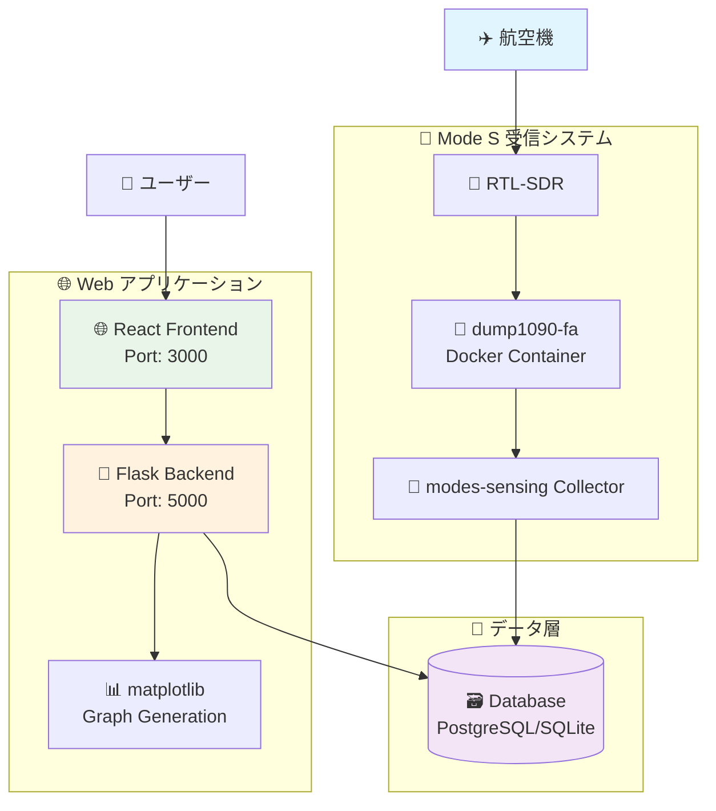
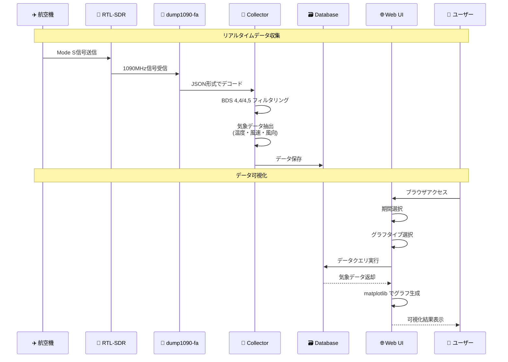
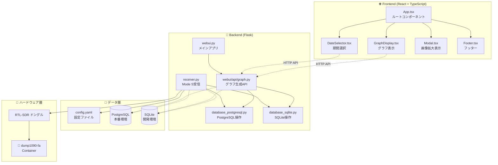

# ✈️ modes-sensing

航空機から送信される DDR Mode S メッセージを受信し、気象データを可視化するシステム

[](https://github.com/kimata/modes-sensing/actions/workflows/test.yaml)
[](https://kimata.github.io/modes-sensing/pytest.html)
[](https://coveralls.io/github/kimata/modes-sensing?branch=main)

## 📑 目次

- [📋 概要](#-概要)
    - [主な特徴](#主な特徴)
- [🎮 デモ](#-デモ)
- [🏗️ システム構成](#️-システム構成)
    - [アーキテクチャ概要](#アーキテクチャ概要)
    - [データフロー](#データフロー)
    - [コンポーネント構成](#コンポーネント構成)
- [🚀 セットアップ](#-セットアップ)
    - [必要な環境](#必要な環境)
    - [1. 依存パッケージのインストール](#1-依存パッケージのインストール)
    - [2. Mode S デコーダーの準備](#2-mode-s-デコーダーの準備)
    - [3. 設定ファイルの準備](#3-設定ファイルの準備)
- [💻 実行方法](#-実行方法)
    - [データ収集の開始](#データ収集の開始)
    - [Web インターフェースの起動](#web-インターフェースの起動)
- [🧪 テスト](#-テスト)
- [🎯 API エンドポイント](#-api-エンドポイント)
    - [グラフ生成](#グラフ生成)
    - [ヘルスチェック](#ヘルスチェック)
- [📊 グラフの種類](#-グラフの種類)
- [🔧 カスタマイズ](#-カスタマイズ)
    - [フィルタリング設定](#フィルタリング設定)
    - [グラフのカスタマイズ](#グラフのカスタマイズ)
- [📡 Mode S について](#-mode-s-について)
- [🛠️ トラブルシューティング](#️-トラブルシューティング)
- [📝 ライセンス](#-ライセンス)

## 📋 概要

航空機が送信する SSR Mode S メッセージ（BDS 4,4 および BDS 4,5）から気象データ（気温・風速・風向）を抽出し、可視化するシステムです。高度別の大気状態をリアルタイムで観測できます。

### 主な特徴

- ✈️ **リアルタイム受信** - Mode S メッセージをリアルタイムで受信・デコード
- 🌡️ **気象データ抽出** - 航空機から送信される気温・風速・風向データを取得
- 📊 **多彩な可視化** - 2D/3D 散布図、ヒートマップ、等高線、温度・風向プロットなど8種類
- 🗄️ **データベース保存** - PostgreSQL/SQLite による長期データ保存
- 📅 **期間選択** - 過去24時間、7日間、1ヶ月間、カスタム期間での表示
- 🚀 **高速処理** - カラム選択による最適化されたデータベースアクセス
- 📱 **レスポンシブUI** - スマートフォンからPCまで対応

## 🎮 デモ

実際の動作を体験できるデモサイト（準備中）：

🔗 https://modes-sensing-demo.example.com/

## 🏗️ システム構成

### アーキテクチャ概要



### データフロー



### コンポーネント構成



## 🚀 セットアップ

### 必要な環境

- **Python 3.11+** - メインアプリケーション（推奨: 3.13）
- **Node.js 18.x 以上** - React フロントエンド
- **PostgreSQL 14+** (本番環境) または **SQLite** (開発環境)
- **RTL-SDR ドングル** - Mode S 信号受信用
- **Docker** - dump1090-fa コンテナ実行用

### 1. 依存パッケージのインストール

```bash
# システムパッケージ
sudo apt update
sudo apt install postgresql postgresql-contrib
sudo apt install rtl-sdr docker.io

# Docker サービスの開始
sudo systemctl enable docker
sudo systemctl start docker

# ユーザーをDockerグループに追加
sudo usermod -a -G docker $USER

# Python環境（uvを使用）
curl -LsSf https://astral.sh/uv/install.sh | sh
uv sync

# React環境
cd react
npm ci
```

### 2. Mode S デコーダーの準備

#### RTL-SDR ドングルの設定

```bash
# RTL-SDR ドライバーの確認
lsusb | grep RTL
```

#### dump1090-fa の Docker コンテナ起動

[kimata/dump1090-fa](https://github.com/kimata/dump1090-fa) のDockerコンテナを使用します：

```bash
# dump1090-fa Docker イメージの取得と起動
docker run -d \
  --name dump1090-fa \
  --device=/dev/bus/usb \
  --restart=unless-stopped \
  -p 30002:30002 \
  -p 8080:8080 \
  registry.gitlab.com/kimata/dump1090-fa:latest

# コンテナの動作確認
docker logs dump1090-fa

# 受信状況の確認（Web UI）
# ブラウザで http://localhost:8080 にアクセス
```

#### 接続確認

```bash
# dump1090 からのデータ受信確認
nc localhost 30002
```

### 3. 設定ファイルの準備

```bash
cp config.example.yaml config.yaml
# config.yaml を環境に合わせて編集
```

実際の設定項目：

```yaml
modes:
    decoder:
        host: localhost # dump1090 ホスト
        port: 30002 # dump1090 ポート

database:
    host: localhost
    port: 5432
    name: flight_weather
    user: postgres
    pass: postgres

filter:
    area:
        lat:
            ref: 35.682677 # 基準緯度（東京）
        lon:
            ref: 139.762230 # 基準経度（東京）
        distance: 100 # フィルタ距離 (km)

font:
    path: ./font
    map:
        jp_medium: migmix-1p-regular.ttf
        jp_bold: migmix-1p-bold.ttf

webapp:
    static_dir_path: react/dist
    cache_dir_path: cache # グラフキャッシュディレクトリ

liveness:
    file:
        collector: /dev/shm/modes-sensing/liveness/collector
        receiver: /dev/shm/modes-sensing/liveness/receiver

# Slack 通知設定（オプション）
slack:
    from: ModeS sensing
    bot_token: xoxp-XXXX...
    error:
        channel:
            name: "#error"
            id: C04XXXXXXXX
        interval_min: 180
```

## 💻 実行方法

### データ収集の開始

```bash
# Mode S メッセージの収集開始
uv run python src/collect.py

# 設定ファイルを指定して実行
uv run python src/collect.py -c custom_config.yaml

# 受信回数を指定（テスト用）
uv run python src/collect.py -n 100

# デバッグモードで実行
uv run python src/collect.py -D

# バックグラウンドで実行
nohup uv run python src/collect.py > collect.log 2>&1 &
```

### Web インターフェースの起動

#### 本番環境での起動

```bash
# React アプリのビルド
cd react
npm run build
cd ..

# Flask サーバーの起動
uv run python src/webui.py

# 設定ファイルを指定
uv run python src/webui.py -c production_config.yaml

# ポート指定
uv run python src/webui.py -p 8080
```

#### Docker での実行

```bash
# Docker イメージのビルド
docker build -t modes-sensing .

# コンテナの実行（collect.py がデフォルト）
docker run -d \
  --name modes-sensing \
  --device=/dev/bus/usb \
  -v $(pwd)/config.yaml:/opt/modes-sensing/config.yaml \
  modes-sensing
```

最終的にブラウザで http://localhost:5000 にアクセス

## 🧪 テスト

```bash
# 全テストの実行
uv run pytest

# カバレッジ付きテスト実行
uv run pytest --cov=src --cov-report=html

# 特定のテストファイルを実行
uv run pytest tests/test_database.py

# 詳細モードでの実行
uv run pytest -v -s

# pre-commit フックの実行
uv run pre-commit run --all-files
```

テスト結果の確認：

- **HTMLカバレッジレポート**: `htmlcov/index.html`
- **テストログ**: コンソール出力
- **pre-commit結果**: lint、format、型チェックの結果

## 🎯 API エンドポイント

### グラフ生成（非同期ジョブベース）

グラフ生成は非同期ジョブとして実行されます。

#### ジョブ登録

```
POST /modes-sensing/api/graph/job
Content-Type: application/json

{
    "graphs": ["scatter_2d", "contour_2d"],
    "start": "2025-01-01T00:00:00Z",
    "end": "2025-01-07T00:00:00Z",
    "limit_altitude": false
}

Response: {"jobs": [{"job_id": "uuid", "graph_name": "scatter_2d"}, ...]}
```

#### ジョブステータス確認

```
GET /modes-sensing/api/graph/job/{job_id}/status

Response: {
    "job_id": "uuid",
    "status": "completed",  // pending, processing, completed, failed, timeout
    "progress": 100,
    "graph_name": "scatter_2d",
    "elapsed_seconds": 12.5
}
```

#### 結果取得

```
GET /modes-sensing/api/graph/job/{job_id}/result

Response: PNG 画像データ
```

### データ情報

- `GET /modes-sensing/api/data-range` - データの最古・最新日時を取得
- `GET /modes-sensing/api/aggregate-stats` - 集約統計情報を取得

### ヘルスチェック

- `GET /healthz` - サービスの生存確認

## 📊 グラフの種類

| グラフタイプ | 説明                           | 適用場面                 | graph_name       |
| ------------ | ------------------------------ | ------------------------ | ---------------- |
| 2D散布図     | 時間-高度-温度の関係を点で表示 | 全体的な傾向の把握       | `scatter_2d`     |
| 3D散布図     | 時間-高度-温度を3次元で表示    | 立体的なデータ分布の確認 | `scatter_3d`     |
| ヒートマップ | 格子状に補間した温度分布       | 連続的な温度変化の可視化 | `heatmap`        |
| 2D等高線     | 等温線による表示               | 温度層の境界確認         | `contour_2d`     |
| 3D等高線     | 3次元の等温面表示              | 複雑な温度構造の把握     | `contour_3d`     |
| 密度プロット | 高度-温度の分布密度            | データの集中度分析       | `density`        |
| 温度プロット | 時間-温度の推移表示            | 温度変化の時系列分析     | `temperature`    |
| 風向プロット | 高度別の風向・風速表示         | 風のパターン分析         | `wind_direction` |

## 🔧 カスタマイズ

### フィルタリング設定

`config.yaml` でデータフィルタリングの設定をカスタマイズできます：

```yaml
filter:
    area:
        lat:
            ref: 35.682677 # 基準緯度
        lon:
            ref: 139.762230 # 基準経度
        distance: 100 # フィルタ距離 (km)
```

高度制限オプション (`limit_altitude`) を有効にすると、低高度（2000m以下）のデータに絞り込んで表示できます。

### グラフのカスタマイズ

`src/modes/webui/api/graph.py` でグラフの外観をカスタマイズできます：

```python
# 解像度設定
IMAGE_DPI = 200.0

# 温度範囲設定（通常モード）
TEMP_MIN_DEFAULT = -80
TEMP_MAX_DEFAULT = 30

# 温度範囲設定（低高度モード: limit_altitude=True）
TEMP_MIN_LIMITED = -20
TEMP_MAX_LIMITED = 40

# 高度範囲設定
ALT_MIN = 0
ALT_MAX = 13000
ALTITUDE_LIMIT = 2000  # 高度制限時の最大値
```

## 📡 Mode S について

Mode S（Mode Select）は航空機が自動的に送信する航空交通管制用の信号です。

### BDS レジスタ

| BDS     | 内容           | 含まれるデータ   |
| ------- | -------------- | ---------------- |
| BDS 4,4 | 気象データ     | 気温、風速、風向 |
| BDS 4,5 | 拡張気象データ | 湿度、乱気流強度 |

### データ抽出の仕組み

1. **信号受信**: RTL-SDR で 1090MHz 帯の信号を受信
2. **デコード**: dump1090 で Mode S メッセージをデコード
3. **フィルタリング**: BDS 4,4/4,5 のメッセージのみを抽出
4. **データ変換**: 生データから気象データ（温度・風速等）に変換
5. **品質チェック**: 異常値やノイズを除去
6. **データベース保存**: 時系列データとして保存

## 🛠️ トラブルシューティング

### よくある問題

#### 1. RTL-SDR が認識されない

```bash
# デバイスの確認
lsusb | grep RTL

# ドライバーの再インストール
sudo apt remove rtl-sdr
sudo apt install rtl-sdr

# 権限の確認
sudo usermod -a -G plugdev $USER
```

#### 2. dump1090-fa コンテナが起動しない

```bash
# コンテナ状態の確認
docker ps -a | grep dump1090-fa

# ログの確認
docker logs dump1090-fa

# コンテナの再起動
docker restart dump1090-fa

# RTL-SDR デバイスの確認
ls -la /dev/bus/usb/
```

#### 3. データベース接続エラー

```bash
# PostgreSQL サービスの確認
sudo systemctl status postgresql

# 接続テスト
psql -h localhost -U postgres -d modes

# SQLite ファイルの権限確認（開発環境の場合）
ls -la data/modes.db
```

#### 4. React アプリのビルドエラー

```bash
# Node.js バージョンの確認
node --version
npm --version

# 依存関係の再インストール
cd react
rm -rf node_modules package-lock.json
npm ci
```

#### 5. グラフが表示されない

- **データの確認**: データベースにデータが保存されているかチェック
- **期間設定**: 選択した期間にデータが存在するかチェック
- **ブラウザ**: キャッシュをクリアして再読み込み
- **ログ**: Web UI サーバーのログでエラーを確認

### ログファイルの場所

- **Collector**: `collect.log` (バックグラウンド実行時)
- **Web UI**: コンソール出力
- **dump1090-fa**: `docker logs dump1090-fa`
- **PostgreSQL**: `/var/log/postgresql/`

## 📝 ライセンス

このプロジェクトは Apache License Version 2.0 のもとで公開されています。

---

<div align="center">

**⭐ このプロジェクトが役に立った場合は、Star をお願いします！**

[🐛 Issue 報告](https://github.com/kimata/modes-sensing/issues) | [💡 Feature Request](https://github.com/kimata/modes-sensing/issues/new?template=feature_request.md) | [📖 Wiki](https://github.com/kimata/modes-sensing/wiki)

</div>
