# ✈️ modes-sensing

航空機から送信される Mode S メッセージを受信し、気象データを可視化するシステム

[](https://github.com/kimata/modes-sensing/actions/workflows/regression.yaml)

## 📑 目次

- [📋 概要](#-概要)
    - [主な特徴](#主な特徴)
- [🎮 デモ](#-デモ)
- [🏗️ システム構成](#️-システム構成)
    - [アーキテクチャ概要](#アーキテクチャ概要)
    - [データフロー](#データフロー)
    - [コンポーネント構成](#コンポーネント構成)
- [🚀 セットアップ](#-セットアップ)
    - [必要な環境](#必要な環境)
    - [1. 依存パッケージのインストール](#1-依存パッケージのインストール)
    - [2. Mode S デコーダーの準備](#2-mode-s-デコーダーの準備)
    - [3. 設定ファイルの準備](#3-設定ファイルの準備)
- [💻 実行方法](#-実行方法)
    - [データ収集の開始](#データ収集の開始)
    - [Web インターフェースの起動](#web-インターフェースの起動)
- [🧪 テスト](#-テスト)
- [🎯 API エンドポイント](#-api-エンドポイント)
    - [グラフ生成](#グラフ生成)
    - [ヘルスチェック](#ヘルスチェック)
- [📊 グラフの種類](#-グラフの種類)
- [🔧 カスタマイズ](#-カスタマイズ)
    - [フィルタリング設定](#フィルタリング設定)
    - [グラフのカスタマイズ](#グラフのカスタマイズ)
- [📡 Mode S について](#-mode-s-について)
- [🛠️ トラブルシューティング](#️-トラブルシューティング)
- [📊 CI/CD](#-cicd)
- [📝 ライセンス](#-ライセンス)

## 📋 概要

航空機が送信する Mode S メッセージ（BDS 4,4 および BDS 4,5）から気象データ（気温・風速・風向）を抽出し、可視化するシステムです。高度別の大気状態をリアルタイムで観測できます。

### 主な特徴

- ✈️ **リアルタイム受信** - Mode S メッセージをリアルタイムで受信・デコード
- 🌡️ **気象データ抽出** - 航空機から送信される気温・風速・風向データを取得
- 📊 **多彩な可視化** - 2D/3D 散布図、ヒートマップ、等高線プロットなど
- 🗄️ **データベース保存** - PostgreSQL/SQLite による長期データ保存
- 📅 **期間選択** - 過去24時間、7日間、1ヶ月間、カスタム期間での表示
- 🚀 **高速処理** - カラム選択による最適化されたデータベースアクセス
- 📱 **レスポンシブUI** - スマートフォンからPCまで対応

## 🎮 デモ

実際の動作を体験できるデモサイト（準備中）：

🔗 https://modes-sensing-demo.example.com/

## 🏗️ システム構成

### アーキテクチャ概要

```mermaid
flowchart TD
    A[✈️ 航空機] --> B[📡 RTL-SDR]
    B --> C[🐳 dump1090-fa<br/>Docker Container]
    C --> D[🐍 modes-sensing Collector]
    D --> E[(🗃️ Database<br/>PostgreSQL/SQLite)]

    F[👤 ユーザー] --> G[🌐 React Frontend<br/>Port: 3000]
    G --> H[🐍 Flask Backend<br/>Port: 5000]
    H --> E
    H --> I[📊 matplotlib<br/>Graph Generation]

    subgraph "📡 Mode S 受信システム"
        B
        C
        D
    end

    subgraph "🌐 Web アプリケーション"
        G
        H
        I
    end

    subgraph "💾 データ層"
        E
    end

    style A fill:#e1f5fe
    style E fill:#f3e5f5
    style G fill:#e8f5e8
    style H fill:#fff3e0
```



### データフロー

```mermaid
sequenceDiagram
    participant A as ✈️ 航空機
    participant RTL as 📡 RTL-SDR
    participant D1090 as 🐳 dump1090-fa
    participant COL as 🐍 Collector
    participant DB as 🗃️ Database
    participant WEB as 🌐 Web UI
    participant USR as 👤 ユーザー

    Note over A,USR: リアルタイムデータ収集
    A->>RTL: Mode S信号送信
    RTL->>D1090: 1090MHz信号受信
    D1090->>COL: JSON形式でデコード
    COL->>COL: BDS 4,4/4,5 フィルタリング
    COL->>COL: 気象データ抽出<br/>(温度・風速・風向)
    COL->>DB: データ保存

    Note over A,USR: データ可視化
    USR->>WEB: ブラウザアクセス
    WEB->>WEB: 期間選択
    WEB->>WEB: グラフタイプ選択
    WEB->>DB: データクエリ実行
    DB-->>WEB: 気象データ返却
    WEB->>WEB: matplotlib でグラフ生成
    WEB-->>USR: 可視化結果表示
```



### コンポーネント構成

```mermaid
graph TB
    subgraph "🌐 Frontend (React + TypeScript)"
        APP[App.tsx<br/>ルートコンポーネント]
        DS[DateSelector.tsx<br/>期間選択]
        GD[GraphDisplay.tsx<br/>グラフ表示]
        MOD[Modal.tsx<br/>画像拡大表示]
        FOOT[Footer.tsx<br/>フッター]

        APP --> DS
        APP --> GD
        APP --> MOD
        APP --> FOOT
    end

    subgraph "🐍 Backend (Flask)"
        MAIN[webui.py<br/>メインアプリ]
        REC[receiver.py<br/>Mode S受信]
        DBPG[database_postgresql.py<br/>PostgreSQL操作]
        DBSQ[database_sqlite.py<br/>SQLite操作]
        GRAPH[webui/api/graph.py<br/>グラフ生成API]

        MAIN --> GRAPH
        REC --> DBPG
        REC --> DBSQ
        GRAPH --> DBPG
        GRAPH --> DBSQ
    end

    subgraph "💾 データ層"
        CONFIG[config.yaml<br/>設定ファイル]
        POSTGRES[(PostgreSQL<br/>本番環境)]
        SQLITE[(SQLite<br/>開発環境)]
    end

    subgraph "📡 ハードウェア層"
        SDR[RTL-SDR ドングル]
        D1090[🐳 dump1090-fa<br/>Container]
    end

    DS -.->|HTTP API| GRAPH
    GD -.->|HTTP API| GRAPH

    REC --> CONFIG
    REC --> SDR
    SDR --> D1090

    GRAPH -.-> POSTGRES
    GRAPH -.-> SQLITE
    REC -.-> POSTGRES
    REC -.-> SQLITE
```



## 🚀 セットアップ

### 必要な環境

- **Python 3.10+** - メインアプリケーション
- **Node.js 18.x 以上** - React フロントエンド
- **PostgreSQL 14+** (本番環境) または **SQLite** (開発環境)
- **RTL-SDR ドングル** - Mode S 信号受信用
- **Docker** - dump1090-fa コンテナ実行用

### 1. 依存パッケージのインストール

```bash
# システムパッケージ
sudo apt update
sudo apt install postgresql postgresql-contrib
sudo apt install rtl-sdr docker.io

# Docker サービスの開始
sudo systemctl enable docker
sudo systemctl start docker

# ユーザーをDockerグループに追加
sudo usermod -a -G docker $USER

# Python環境（uvを使用）
curl -LsSf https://astral.sh/uv/install.sh | sh
uv sync

# React環境
cd react
npm ci
```

### 2. Mode S デコーダーの準備

#### RTL-SDR ドングルの設定

```bash
# RTL-SDR ドライバーの確認
lsusb | grep RTL
```

#### dump1090-fa の Docker コンテナ起動

[kimata/dump1090-fa](https://github.com/kimata/dump1090-fa) のDockerコンテナを使用します：

```bash
# dump1090-fa Docker イメージの取得と起動
docker run -d \
  --name dump1090-fa \
  --device=/dev/bus/usb \
  --restart=unless-stopped \
  -p 30002:30002 \
  -p 8080:8080 \
  registry.gitlab.com/kimata/dump1090-fa:latest

# コンテナの動作確認
docker logs dump1090-fa

# 受信状況の確認（Web UI）
# ブラウザで http://localhost:8080 にアクセス
```

#### 接続確認

```bash
# dump1090 からのデータ受信確認
nc localhost 30002
```

### 3. 設定ファイルの準備

```bash
cp config.example.yaml config.yaml
# config.yaml を環境に合わせて編集
```

実際の設定項目：

```yaml
modes:
    decoder:
        host: localhost # dump1090 ホスト
        port: 30002 # dump1090 ポート

database:
    host: localhost
    port: 5432
    name: modes
    user: postgres
    pass: postgres

filter:
    area:
        lat:
            ref: 35.682677 # 基準緯度（東京）
        lon:
            ref: 139.762230 # 基準経度（東京）
        distance: 150 # フィルタ距離 (km)

font:
    path: ./font
    map:
        jp_medium: A-OTF-UDShinGoPr6N-Medium.otf
        jp_bold: A-OTF-UDShinGoPr6N-Bold.otf

webapp:
    static_dir_path: react/dist

liveness:
    file:
        collector: /dev/shm/modes-sensing/liveness/collector
```

## 💻 実行方法

### データ収集の開始

```bash
# Mode S メッセージの収集開始
uv run python src/collect.py

# 設定ファイルを指定して実行
uv run python src/collect.py -c custom_config.yaml

# 受信回数を指定（テスト用）
uv run python src/collect.py -n 100

# デバッグモードで実行
uv run python src/collect.py -D

# バックグラウンドで実行
nohup uv run python src/collect.py > collect.log 2>&1 &
```

### Web インターフェースの起動

#### 本番環境での起動

```bash
# React アプリのビルド
cd react
npm run build
cd ..

# Flask サーバーの起動
uv run python src/webui.py

# 設定ファイルを指定
uv run python src/webui.py -c production_config.yaml

# ポート指定
uv run python src/webui.py -p 8080
```

#### Docker での実行

```bash
# Docker イメージのビルド
docker build -t modes-sensing .

# コンテナの実行（collect.py がデフォルト）
docker run -d \
  --name modes-sensing \
  --device=/dev/bus/usb \
  -v $(pwd)/config.yaml:/opt/modes-sensing/config.yaml \
  modes-sensing
```

最終的にブラウザで http://localhost:5000 にアクセス

## 🧪 テスト

```bash
# 全テストの実行
uv run pytest

# カバレッジ付きテスト実行
uv run pytest --cov=src --cov-report=html

# 特定のテストファイルを実行
uv run pytest tests/test_database.py

# 詳細モードでの実行
uv run pytest -v -s

# pre-commit フックの実行
uv run pre-commit run --all-files
```

テスト結果の確認：

- **HTMLカバレッジレポート**: `htmlcov/index.html`
- **テストログ**: コンソール出力
- **pre-commit結果**: lint、format、型チェックの結果

## 🎯 API エンドポイント

### グラフ生成

- `GET /modes-sensing/api/graph/scatter_2d` - 2D散布図の生成
- `GET /modes-sensing/api/graph/scatter_3d` - 3D散布図の生成
- `GET /modes-sensing/api/graph/heatmap` - ヒートマップの生成
- `GET /modes-sensing/api/graph/contour_2d` - 2D等高線図の生成
- `GET /modes-sensing/api/graph/contour_3d` - 3D等高線図の生成
- `GET /modes-sensing/api/graph/density` - 密度プロットの生成

#### パラメータ

| パラメータ | 型     | 説明                | 例                    |
| ---------- | ------ | ------------------- | --------------------- |
| `start`    | string | 開始日時 (ISO 8601) | `2025-08-01T00:00:00` |
| `end`      | string | 終了日時 (ISO 8601) | `2025-08-03T23:59:59` |

#### レスポンス例

```bash
# 2D散布図の生成
curl "http://localhost:5000/modes-sensing/graph/scatter_2d?start=2025-08-01T00:00:00&end=2025-08-03T23:59:59&distance=100"
```

### ヘルスチェック

- `GET /healthz` - サービスの生存確認

注意: `/api/status` エンドポイントは実装されていません。

## 📊 グラフの種類

| グラフタイプ | 説明                           | 適用場面                 | API エンドポイント                    |
| ------------ | ------------------------------ | ------------------------ | ------------------------------------- |
| 2D散布図     | 時間-高度-温度の関係を点で表示 | 全体的な傾向の把握       | `/modes-sensing/api/graph/scatter_2d` |
| 3D散布図     | 時間-高度-温度を3次元で表示    | 立体的なデータ分布の確認 | `/modes-sensing/api/graph/scatter_3d` |
| ヒートマップ | 格子状に補間した温度分布       | 連続的な温度変化の可視化 | `/modes-sensing/api/graph/heatmap`    |
| 2D等高線     | 等温線による表示               | 温度層の境界確認         | `/modes-sensing/api/graph/contour_2d` |
| 3D等高線     | 3次元の等温面表示              | 複雑な温度構造の把握     | `/modes-sensing/api/graph/contour_3d` |
| 密度プロット | 高度-温度の分布密度            | データの集中度分析       | `/modes-sensing/api/graph/density`    |

## 🔧 カスタマイズ

### フィルタリング設定

`config.yaml` でデータフィルタリングの設定をカスタマイズできます：

```yaml
filter:
    area:
        lat:
            ref: 35.682677 # 基準緯度
        lon:
            ref: 139.762230 # 基準経度
        distance: 150 # フィルタ距離 (km)
```

注意: 高度フィルタや BDS サブタイプフィルタは、コード内のハードコーディングされた定数で制御されています。

### グラフのカスタマイズ

`src/modes/webui/api/graph.py` でグラフの外観をカスタマイズできます：

```python
# 解像度設定
IMAGE_DPI = 200.0

# 温度範囲設定
TEMP_MIN = -80
TEMP_MAX = 30

# 高度範囲設定
ALT_MIN = 0
ALT_MAX = 14000

# フォントサイズ設定
TICK_LABEL_SIZE = 8
AXIS_LABEL_SIZE = 12
TITLE_SIZE = 20
```

## 📡 Mode S について

Mode S（Mode Select）は航空機が自動的に送信する航空交通管制用の信号です。

### BDS レジスタ

| BDS     | 内容           | 含まれるデータ   |
| ------- | -------------- | ---------------- |
| BDS 4,4 | 気象データ     | 気温、風速、風向 |
| BDS 4,5 | 拡張気象データ | 湿度、乱気流強度 |

### データ抽出の仕組み

1. **信号受信**: RTL-SDR で 1090MHz 帯の信号を受信
2. **デコード**: dump1090 で Mode S メッセージをデコード
3. **フィルタリング**: BDS 4,4/4,5 のメッセージのみを抽出
4. **データ変換**: 生データから気象データ（温度・風速等）に変換
5. **品質チェック**: 異常値やノイズを除去
6. **データベース保存**: 時系列データとして保存

## 🛠️ トラブルシューティング

### よくある問題

#### 1. RTL-SDR が認識されない

```bash
# デバイスの確認
lsusb | grep RTL

# ドライバーの再インストール
sudo apt remove rtl-sdr
sudo apt install rtl-sdr

# 権限の確認
sudo usermod -a -G plugdev $USER
```

#### 2. dump1090-fa コンテナが起動しない

```bash
# コンテナ状態の確認
docker ps -a | grep dump1090-fa

# ログの確認
docker logs dump1090-fa

# コンテナの再起動
docker restart dump1090-fa

# RTL-SDR デバイスの確認
ls -la /dev/bus/usb/
```

#### 3. データベース接続エラー

```bash
# PostgreSQL サービスの確認
sudo systemctl status postgresql

# 接続テスト
psql -h localhost -U postgres -d modes

# SQLite ファイルの権限確認（開発環境の場合）
ls -la data/modes.db
```

#### 4. React アプリのビルドエラー

```bash
# Node.js バージョンの確認
node --version
npm --version

# 依存関係の再インストール
cd react
rm -rf node_modules package-lock.json
npm ci
```

#### 5. グラフが表示されない

- **データの確認**: データベースにデータが保存されているかチェック
- **期間設定**: 選択した期間にデータが存在するかチェック
- **ブラウザ**: キャッシュをクリアして再読み込み
- **ログ**: Web UI サーバーのログでエラーを確認

### ログファイルの場所

- **Collector**: `collect.log` (バックグラウンド実行時)
- **Web UI**: コンソール出力
- **dump1090-fa**: `docker logs dump1090-fa`
- **PostgreSQL**: `/var/log/postgresql/`

## 📊 CI/CD

GitHub Actions による CI/CD パイプライン：

- **回帰テスト**: https://github.com/kimata/modes-sensing/actions
- **テストカバレッジ**: pytest でのカバレッジ測定
- **コード品質**: pre-commit フックによる lint とフォーマット
- **型チェック**: mypy による静的型解析

### ワークフロー

1. **Pull Request 作成**
    - 自動テスト実行
    - コード品質チェック
    - カバレッジ測定

2. **main ブランチマージ**
    - 全テスト実行
    - ドキュメント生成
    - リリースタグ作成（必要に応じて）

## 📝 ライセンス

このプロジェクトは Apache License Version 2.0 のもとで公開されています。

---

<div align="center">

**⭐ このプロジェクトが役に立った場合は、Star をお願いします！**

[🐛 Issue 報告](https://github.com/kimata/modes-sensing/issues) | [💡 Feature Request](https://github.com/kimata/modes-sensing/issues/new?template=feature_request.md) | [📖 Wiki](https://github.com/kimata/modes-sensing/wiki)

</div>
