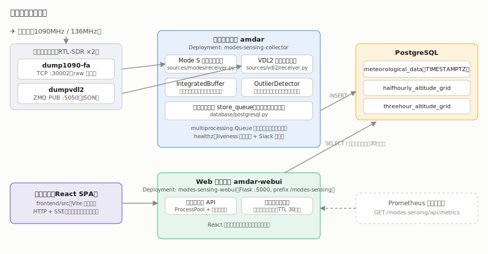
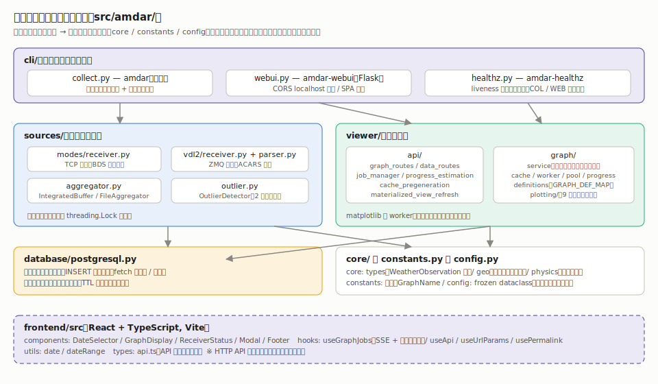
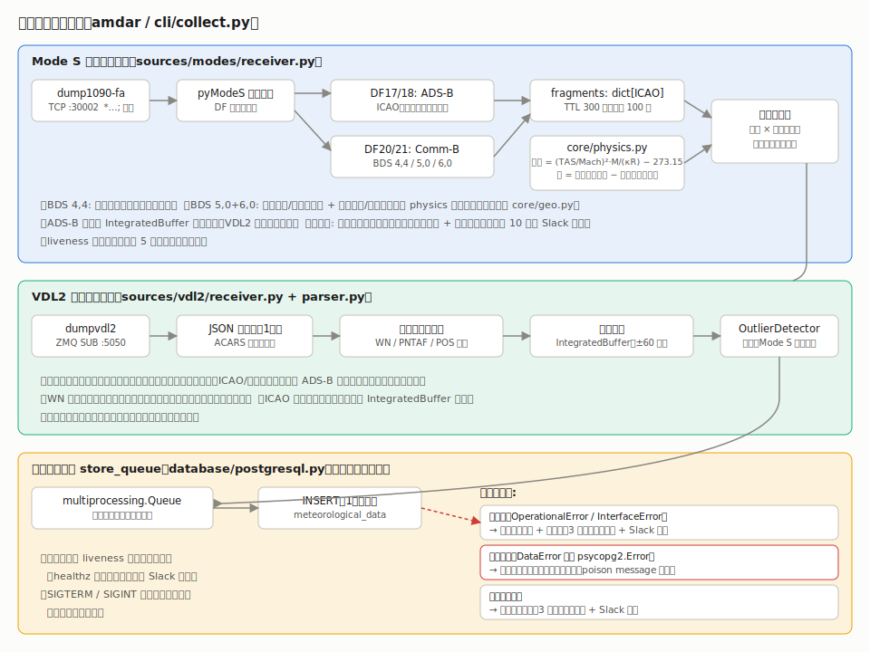
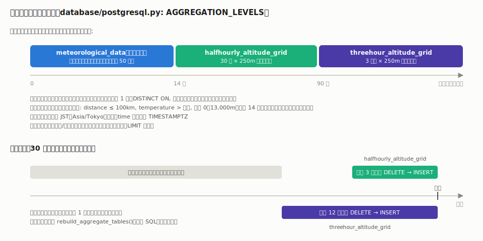
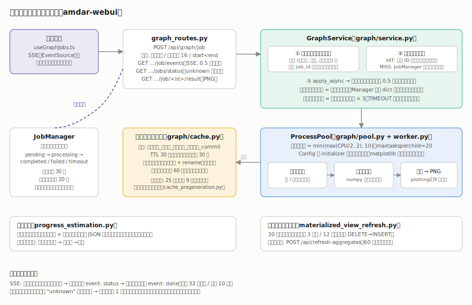

# アーキテクチャ

**modes-sensing** は、航空機が送信する Mode S / VDL2 メッセージから気象データ（気温・風向・風速）を抽出し、PostgreSQL に蓄積して Web で可視化するシステムです。本書は実装（`src/` および `frontend/src/`）に基づくアーキテクチャ解説です。

- 収集: `uv run amdar`（`src/amdar/cli/collect.py`）
- 可視化: `uv run amdar-webui`（`src/amdar/cli/webui.py`、Flask :5000、URL prefix `/modes-sensing`）
- 死活監視: `uv run amdar-healthz`（`src/amdar/cli/healthz.py`）

## 全体構成



収集プロセスと Web サーバーは独立したプロセス（Kubernetes 上では別 Deployment。`kubernetes/sensor-modes.yaml`）で、PostgreSQL のみを介して連携します。フロントエンド（React SPA）は Flask が同一オリジンで静的配信するため、本番では CORS は使われません（開発時の Vite dev server 向けに localhost のみ許可）。

## モジュール構成



```
src/
├── collect_vdl2.py             # VDL2 のみ収集（デバッグ用）
└── amdar/
    ├── __main__.py             # amdar コマンド（cli.collect に委譲）
    ├── cli/
    │   ├── collect.py          # amdar: Mode S + VDL2 統合収集
    │   ├── webui.py            # amdar-webui: Flask Web サーバー
    │   └── healthz.py          # amdar-healthz: liveness 監視（COL/WEB モード）
    ├── config.py               # 設定（frozen dataclass、JSON Schema 検証付き）
    ├── constants.py            # 定数・GraphName（Literal 型）
    ├── core/
    │   ├── types.py            # WeatherObservation / WindData / ParsedWeatherData 等
    │   ├── geo.py              # 距離計算・磁気偏角（国土地理院 2020 年値の近似式）
    │   └── physics.py          # 気温・風ベクトル計算（受信経路とファイル解析経路で共用）
    ├── sources/
    │   ├── modes/receiver.py   # Mode S 受信・BDS デコード・ペアリング
    │   ├── vdl2/receiver.py    # VDL2 ZMQ 受信
    │   ├── vdl2/parser.py      # ACARS 気象報文（WN / PNTAF / POS）解析
    │   ├── aggregator.py       # IntegratedBuffer（高度補完）/ FileAggregator（ファイル解析）
    │   └── outlier.py          # OutlierDetector（外れ値検出）
    ├── database/
    │   └── postgresql.py       # 接続・スキーマ適用・保存ワーカー・fetch・増分集約・品質集計
    └── viewer/
        ├── api/                # Flask ルート・ジョブ管理・進捗推定・事前生成・集約更新
        └── graph/              # GraphService・キャッシュ・ProcessPool・worker・plotting/
```

依存は上から下への一方向です。`core/` `constants.py` `config.py` は他のどの層にも依存しません。物理計算（気温・磁気偏角・風）は `core/physics.py` と `core/geo.py` に一本化されており、リアルタイム受信とファイル解析（`FileAggregator`）が同じ実装を使います。

## 収集パイプライン



### プロセス内のスレッド構成（cli/collect.py）

| スレッド | 実装 | 役割 |
| --- | --- | --- |
| Mode S 受信 | `sources/modes/receiver.py` | dump1090-fa（TCP :30002、`*…;` raw 形式）から受信・デコード |
| VDL2 受信 | `sources/vdl2/receiver.py` | dumpvdl2（ZMQ SUB :5050、JSON）から受信・解析 |
| VDL2 転送 | `cli/collect.py` | VDL2 ローカルキュー → 統合キューへ転送 |
| 統計ログ | `cli/collect.py` | 60 秒毎に IntegratedBuffer の統計を INFO ログ出力 |
| メイン | `database/postgresql.py` `store_queue()` | 統合キューを消費して INSERT |

SIGTERM / SIGINT を受けると受信スレッド・保存ワーカーを順に停止します。各モジュールの可変状態は `_ReceiverState` 等の dataclass 1 つに集約されています。

### Mode S の解析

1. **DF17/18（ADS-B）**: ICAO・便名・位置・高度を取得し、ICAO ごとのフラグメント（`dict[str, _MessageFragment]`、TTL 300 秒・上限 100 件）に記録する。位置は共有 `IntegratedBuffer` にも登録する（VDL2 の高度補完用）。
2. **DF20/21（Comm-B）**: BDS レジスタをデコードする。

   | BDS | 内容 | 抽出データ |
   | --- | --- | --- |
   | 4,4 | 気象データ | 気温・風速・風向（直接取得） |
   | 5,0 | トラック・速度 | トラック角・対地速度・真対気速度 |
   | 6,0 | 機首方位・速度 | 機首方位・指示対気速度・マッハ数 |

3. **気温・風の算出（BDS 5,0 + 6,0 のとき）**: `core/physics.py` で計算する。

   - 気温: `T = (TAS / Mach)² · M / (κ·R) − 273.15`（κ=1.403, M=28.966×10⁻³ kg/mol, R=8.314472）
   - 風: 地速ベクトル − 真対気ベクトル。機首方位（磁方位）は `core/geo.py` の磁気偏角（西偏正）で真方位に補正する。

4. フラグメント上で高度と気象データが揃った時点でペアリングし、温度閾値（`GRAPH_TEMPERATURE_THRESHOLD` = −100℃）未満や `Mach ≤ 0` のレコードは生成せず破棄する。

再接続処理は「その接続で 1 行でも受信できたか」で成否を判定し、受信ゼロの切断・タイムアウト（ソケットタイムアウト 30 秒）はリトライ回数を加算してバックオフします。最大 10 回（`MODES_RECEIVER_MAX_RETRIES`）で停止し Slack 通知します。liveness ファイルの更新は 5 秒間隔にスロットルされます。

### VDL2 の解析

ZMQ で受信した JSON を 1 メッセージ 1 回だけパースし、ACARS 本文から気象報文を抽出します（`vdl2/parser.py`）。

| 形式 | 含まれるデータ | 備考 |
| --- | --- | --- |
| WN | 緯度・経度・高度・気温・風向・風速 | 座標は「度＋分」形式として解釈（実受信データと ADS-B 航跡の照合で検証済み） |
| PNTAF | 緯度・経度・(FL 高度)・気温・風向・風速 | スペース区切り／連続の 2 パターン。FL 高度は連続形式のみ |
| POS | 緯度・経度・FL 高度・気温・風向・風速 | |

高度を含まない報文は `IntegratedBuffer.get_altitude_at()` により、同一機（ICAO またはコールサインで解決）の ADS-B 高度履歴から時刻最近傍（±60 秒）で補完します。補完できない報文は内部フラグメントバッファに一時保留されます。

### IntegratedBuffer（sources/aggregator.py）

- ICAO → 高度履歴（deque）と、コールサイン → ICAO のマッピングを保持。
- Mode S 受信・VDL2 受信・統計ログの 3 スレッドから共有されるため、公開メソッドは `threading.Lock` で排他制御。
- リアルタイム収集では `auto_cleanup=True` で生成され、位置追加時に 10 秒間隔のスロットル付きでウィンドウの 2 倍（120 秒）より古いエントリと、対応する ICAO を失ったコールサインマッピングを破棄する（無限成長の防止）。
- ファイル解析（`FileAggregator`）ではメッセージ順序ベースの補完（`get_altitude_by_order`）も使うため `auto_cleanup=False`。

### 外れ値検出（sources/outlier.py）

`OutlierDetector` は高度-温度相関を利用した 2 段階判定を行います（履歴 30,000 件、判定開始は 100 件から）。

1. **物理的相関チェック**: 履歴に対する線形回帰（高度→温度）の予測値との残差が許容範囲内なら正常とみなす。
2. **高度近傍ベースの異常検知**: 高度が近い 200 点の温度分布に対し、絶対偏差（> 20℃）または z スコア（> 4.0）で異常判定。

回帰モデルと特徴量配列はキャッシュされ、履歴が 50 件追加されるまで再構築しません（受信ホットパスでの毎回再学習を回避）。Mode S / VDL2 の両スレッドが共有するため `threading.Lock` で保護されています。収集開始時には DB の直近データで履歴が初期化されます（`cli/collect.py`）。

### 保存ワーカー（database/postgresql.py store_queue）

統合キューから 1 件ずつ取り出して INSERT します。エラーは 3 分類で処理します。

| 分類 | 例 | 処理 |
| --- | --- | --- |
| 接続系 | `OperationalError` / `InterfaceError` | レコードを保持したまま再接続を試行。3 連続失敗で停止 + Slack 通知 |
| データ系 | 上記以外の `psycopg2.Error`（`DataError` 等） | 当該レコードのみログに残して破棄し、処理を継続（poison message 対策） |
| 想定外 | その他の例外 | レコードを破棄。3 連続失敗で停止 + Slack 通知 |

INSERT 成功時のみ liveness ファイルを更新するため、保存が完全に停滞すると healthz 経由で検知できます。

## データベース

### スキーマ（schema/postgres.schema）

- `meteorological_data`: `time TIMESTAMPTZ` / callsign / distance / altitude / latitude / longitude / temperature / wind_x / wind_y / wind_angle / wind_speed / method（`mode-s` | `vdl2`）
- インデックス: `(time, altitude)` の複合 btree と、時系列範囲検索向けの BRIN
- 集約テーブル: `halfhourly_altitude_grid` / `threehour_altitude_grid`（`(time_bucket, altitude_bin)` UNIQUE）

スキーマ適用は `open(apply_schema=True)`（collector 起動時）または `apply_schema(conn)` で行い、Web サーバー側の接続では実行しません。旧 TIMESTAMP スキーマからの移行 SQL は `scripts/migrate_timestamptz_and_aggregates.sql` にあります。

### 集約戦略



グラフの要求期間に応じて `AGGREGATION_LEVELS` から参照テーブルを自動選択します。

| 要求期間 | テーブル | 粒度 |
| --- | --- | --- |
| 14 日以内 | `meteorological_data` | 生データ（上限 500,000 行） |
| 14〜90 日 | `halfhourly_altitude_grid` | 30 分 × 250m 帯の代表点 |
| 90 日超 | `threehour_altitude_grid` | 3 時間 × 250m 帯の代表点 |

- 集約は平均ではなく各バケットの実観測点 1 つ（`DISTINCT ON`、最新優先）を保持し、描画品質を保ちます。
- 品質フィルタ（distance ≤ 100km、temperature > −100℃、高度 0〜13,000m）は生データ・集約の両経路に共通で、期間 14 日を跨いでも表示条件が変わりません。
- バケット境界は JST（`Asia/Tokyo`）基準です。
- 更新は **増分方式**: 30 分毎に halfhourly は直近 3 時間、threehour は直近 12 時間の窓だけを DELETE → INSERT で置換します（全履歴の再計算はしない）。全量再構築用に `rebuild_aggregate_tables()` も用意されています。

## グラフ生成パイプライン



### ジョブのライフサイクル

1. `POST /api/graph/job` — グラフ名の検証・重複除去・件数上限（16）・`start < end` を検証してジョブを作成。
2. `GraphService.submit_async()` —
   - 同一パラメータ（グラフ名・期間・高度制限）の**実行中ジョブがあれば合流**し、既存の job_id を返す。
   - **キャッシュヒット**なら安定 ID（パラメータのハッシュ）の完了ジョブを即時返す。
   - ミスなら `JobManager` に登録し、ProcessPool へ `apply_async`。
3. ポーリングスレッド（0.5 秒間隔）が完了・失敗・タイムアウトを検知して `JobManager` を更新し、成功時はキャッシュへ保存。
4. クライアントは SSE（後述）またはポーリングで状態を受け取り、`GET /api/graph/job/<id>/result` で PNG を取得。

タイムアウトの起点は**実行開始時刻**です（ワーカーが `multiprocessing.Manager` の共有 dict に開始時刻を記録）。キュー待ちには生成タイムアウトの 3 倍の上限を別途設けます。TIMEOUT 判定後もワーカーの完走結果はキャッシュに保存されます（次回リクエストが即ヒット）。

### ProcessPool と worker

- ワーカー数は `min(max(CPU コア数 / 2, 2), 10)`、`maxtasksperchild=20`。
- `Config` は Pool の initializer で各ワーカーへ一度だけ渡します（タスク毎の pickle 転送なし）。
- **matplotlib はサブプロセス（worker.py）内でのみ使用**します。メインプロセスのエラー画像生成は Pillow で行います。
- 描画関数は `GRAPH_DEF_MAP`（`viewer/graph/definitions.py`）に 10 種類が登録されており、HTTP 層・キャッシュ層・worker 層から共通に参照されます。

### 画像キャッシュ（viewer/graph/cache.py）

- キー: `{グラフ名}_{期間秒}_{高度制限}_{開始時刻}_{git commit}.png`
- TTL 30 分、開始時刻の許容差 30 分（同じ「直近 7 日」ならヒットする）。
- 書き込みは一時ファイル + rename の原子的置換。期限切れ削除は 60 秒間隔にスロットル。
- 事前生成（`cache_pregeneration.py`）が 25 分毎（固定レート）に全 10 種を生成してキャッシュを温めます。期間の終端はフロントエンドのクランプ処理と揃えるため DB の最新データ時刻（分単位に正規化）を使います。

### 進捗の伝搬（SSE）

`GET /api/graph/job/events?job_ids=<カンマ区切り>`（`text/event-stream`）:

- 接続直後に全ジョブのスナップショットを `event: status` で送信。
- 以降は 0.5 秒間隔のチェックで**変化があったときのみ**送信。
- 全ジョブが終端状態（completed / failed / timeout / unknown）になると `event: done` を送って切断。
- 上限: 1 接続 32 ジョブ・保持 10 分。

サーバーが知らない job_id（再起動・30 分の保持期限切れ）は `{"status": "unknown"}` として返されます。フロントエンドは unknown を 1 回だけ自動再作成し、それでも解決しなければエラー表示します。SSE が使えない環境では指数バックオフ付きポーリングへ自動フォールバックします。

## フロントエンド（frontend/src/）

| 区分 | ファイル | 役割 |
| --- | --- | --- |
| components | `DateSelector` | 期間クイック選択 + カスタム期間入力（データ範囲へのクランプ付き） |
| | `GraphDisplay` | グラフグリッド・進捗・エラーカード・再試行 |
| | `ReceiverStatus` | 受信品質表示（`/api/receiver-quality` を 60 秒毎に取得） |
| | `Modal` / `Footer` | 画像拡大・フッター |
| hooks | `useGraphJobs` | ジョブ作成 → SSE 購読（フォールバック: ポーリング）→ 結果取得の状態機械 |
| | `useApi` / `useUrlParams` / `usePermalink` | フェッチ・URL パラメータ同期・パーマリンクコピー |
| utils | `date` / `dateRange` | 日時フォーマット・データ範囲へのクランプ |
| types | `api.ts` | API レスポンス型（`unknown` ステータス含む判別可能ユニオン） |

## HTTP API 一覧

すべて URL prefix `/modes-sensing` 配下です（`cli/webui.py`）。

| メソッド | パス | 内容 |
| --- | --- | --- |
| POST | `/api/graph/job` | グラフ生成ジョブ作成 → `{"jobs": [{"job_id", "graph_name"}, …]}` |
| GET | `/api/graph/job/<id>/status` | 単一ジョブの状態 |
| GET / POST | `/api/graph/jobs/status` | 一括状態取得（`?job_ids=` または JSON body）。不明 ID は `unknown` |
| GET | `/api/graph/job/events` | SSE によるジョブ状態ストリーム |
| GET | `/api/graph/job/<id>/result` | 生成された PNG |
| GET | `/api/graph/jobs/stats` | JobManager 統計 |
| GET | `/api/graph/<graph_name>` | 同期生成（旧 API、ブロッキング） |
| GET | `/api/data-range` | データの最古・最新・件数（10 分 TTL キャッシュ） |
| GET | `/api/last-received` | 受信方式別の最終観測時刻 |
| GET | `/api/receiver-quality` | 受信品質 JSON（1 時間/24 時間の観測数・最終受信・集約行数） |
| GET | `/api/metrics` | Prometheus text format（観測数・受信 age・集約行数・ジョブ数・キャッシュ数） |
| GET | `/api/aggregate-stats` | 集約テーブルの統計 |
| POST | `/api/refresh-aggregates` | 集約テーブルの増分更新を手動実行（60 秒レート制限） |
| GET | `/api/debug/date-parse` | 日時パースのデバッグ（Flask debug モード時のみ） |

## 運用・監視

- **Kubernetes**: `kubernetes/sensor-modes.yaml`。collector と webui は別 Deployment（`Recreate` 戦略、GitLab レジストリの同一イメージ）。collector には healthz を使った livenessProbe が設定されています。
- **healthz**: collector（COL モード）は liveness ファイルの更新停滞を、webui（WEB モード）は HTTP ポートを確認し、異常時は Slack に通知します。
- **メトリクス**: `/api/metrics` を Prometheus で収集すれば、受信レート低下や集約停止などの「静かな劣化」を検知できます。
- **設定**: `config.yaml`（`config.example.yaml` 参照、`config.schema` で検証）。DB 接続情報・受信デコーダのホスト/ポート・基準座標・Slack 設定・liveness ファイルパスを定義します。

## 横断的な設計方針

- **時刻**: DB は TIMESTAMPTZ。アプリ内は aware datetime（`my_lib.time.now()`）で統一し、集約バケットとグラフ表示は JST 基準。UNIX タイムスタンプで足りる用途（ジョブ管理・キャッシュ TTL）は `time.time()`。
- **スレッド安全性**: 複数スレッドが共有するオブジェクト（`IntegratedBuffer` / `OutlierDetector` / `JobManager` / `GraphService` の内部状態）は `threading.Lock` で保護。matplotlib はサブプロセス専用。
- **二重実装の排除**: 物理計算・磁気偏角・BDS デコードはリアルタイム経路とファイル解析経路で単一実装を共有（`core/physics.py`・`core/geo.py`・`modes/receiver.py` の共通ヘルパー）。
- **コーディング規約**: [CLAUDE.md](../CLAUDE.md) を参照（dataclass 優先・定数の `constants.py` 集約・完全修飾 import 等）。
